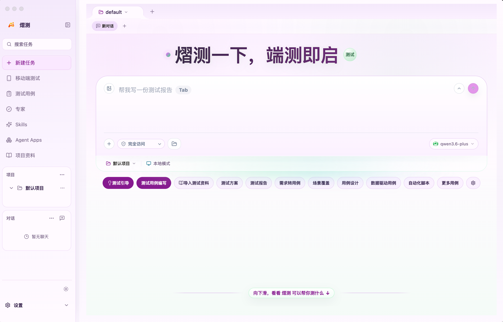
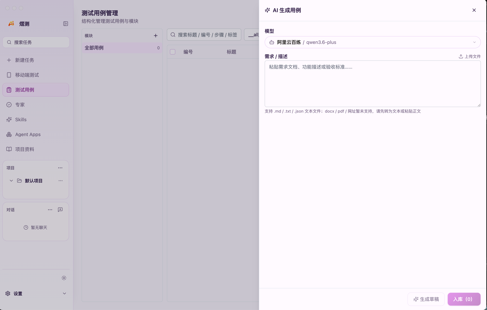
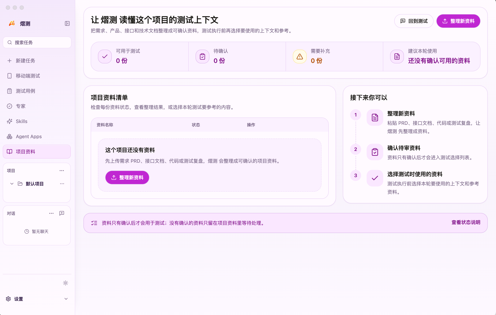
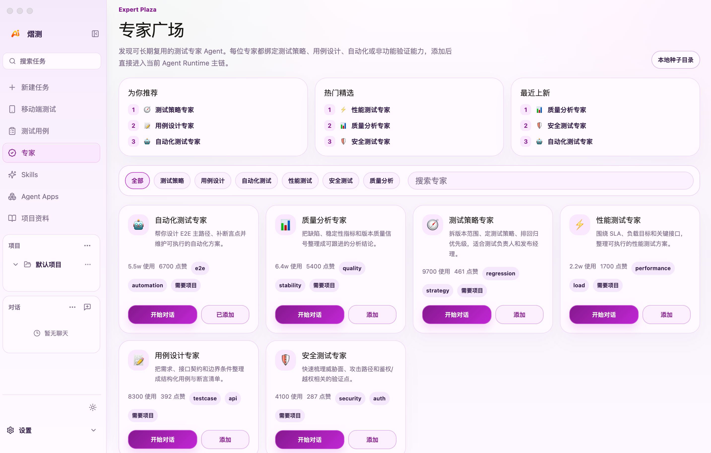
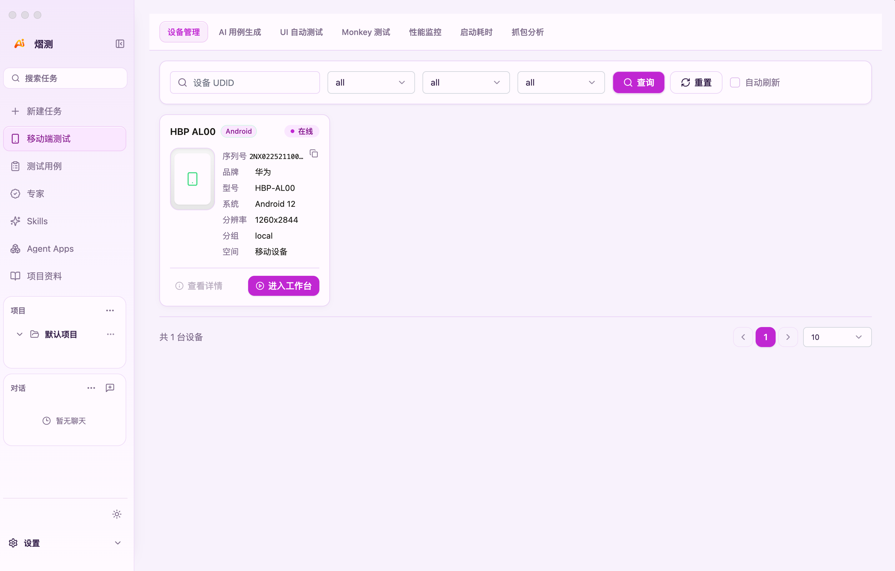
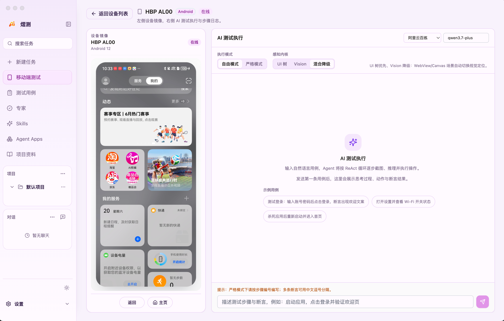
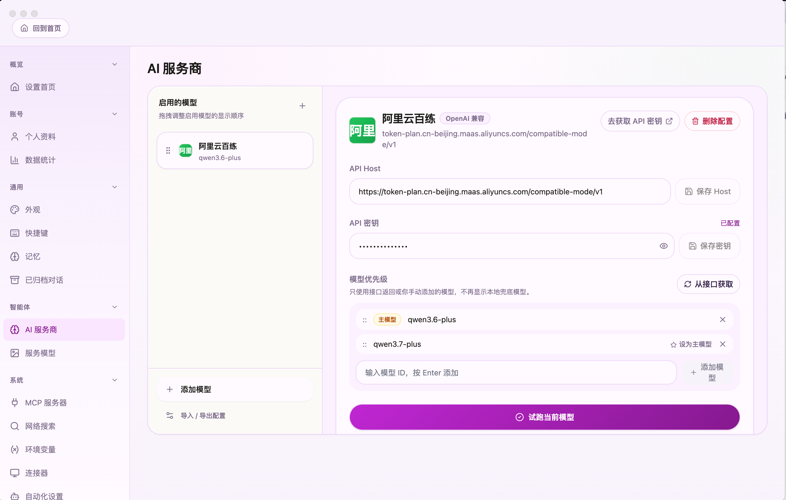

# Ember

### 测试一下，质量即见

**给测试团队用的开源 AI 测试工作台**

AI test workspace for QA teams: test design, regression planning, API/E2E validation, knowledge context, multi-model analysis, and device automation workflows.

**简体中文** · [English](./README.en.md) · [文档](./docs/README.md) · [发布记录](./RELEASE_NOTES.md) · [问题反馈](https://github.com/aitoearn/ember_pc/issues)

  
  
  
  

把需求、测试上下文、用例、执行记录和回归复盘放在一个地方，让一次测试不是一次性聊天，而是一条能继续推进的质量工作流。

---

<kbd>目录</kbd>

- [Ember 是什么](#ember-是什么)
- [你可以用 Ember 做什么](#你可以用-ember-做什么)
- [核心能力](#核心能力)
- [几个测试团队会遇到的真实时刻](#几个测试团队会遇到的真实时刻)
- [一次测试任务可以这样开始](#一次测试任务可以这样开始)
- [适合谁](#适合谁)
- [如果你在找这些工具](#如果你在找这些工具)
- [不太适合谁](#不太适合谁)
- [快速开始](#快速开始)
- [技术栈与平台](#技术栈与平台)
- [常见问题](#常见问题)
- [开源协议](#开源协议)
- [免责声明](#免责声明)

---

## Ember 是什么

Ember 是一个开源的 Electron 桌面端 AI 测试工作台，面向 QA 工程师、测试开发、发布经理和小型质量团队，覆盖用例设计、回归规划、接口验证、E2E 方案、性能与安全测试、项目测试上下文管理和多模型分析流程。

English summary: Ember is an open-source desktop AI workspace for QA teams to design tests, plan regression, validate APIs, organize test context, and reuse multi-model quality workflows.

你可以把它理解成一个更适合长期测试工作的 AI 工作台：

- 不是只问一句、答一句，而是围绕一个版本或项目持续推进验证
- 不是每次都重新找 PRD、接口文档和旧用例，而是把测试上下文和做法沉淀下来
- 不是结论散落在聊天记录里，而是把用例、清单和报告保存下来，下一轮还能继续用
- 不是绑定某一家 AI 服务，而是让你使用自己已经配置好的模型能力

如果你经常在需求文档、接口平台、缺陷系统、自动化脚本和模型后台之间来回切换，Ember 想帮你把这些动作收回到同一个测试空间里。

---

## 你可以用 Ember 做什么

- **从一句测试目标开始**：用自然语言描述测试报告、回归范围、用例设计或专项方案，配合快捷入口快速开工
- **测试用例管理与 AI 生成**：结构化管理模块与用例，把需求文档或验收标准交给 AI 生成草稿并入库
- **项目资料沉淀**：整理 PRD、接口说明、代码片段和测试复盘，让后续任务直接引用已确认上下文
- **专家广场与 Skills**：按测试策略、用例设计、自动化、性能、安全等方向选用专家 Agent 与内置 Skill
- **设备管理与端自动化**：接入 Android 真机/模拟器，进入工作台做 UI 自动测试、Monkey、性能监控与抓包分析
- **移动端 UI 自动测试**：结合设备镜像与自然语言步骤，让 Agent 按 ReAct 循环完成截图、推理与操作
- **接入自己的 AI 模型**：配置 OpenAI 兼容服务商、API Host、密钥与主模型，本地保存不绑定单一厂商

---

## 核心能力

### 从一句测试目标开始

首页围绕当前项目组织任务。你可以直接输入「帮我写一份测试报告」「整理回归范围」等目标，并通过测试引导、测试用例编写、需求转用例、场景覆盖等快捷入口进入对应工作流。

### 测试用例管理与 AI 生成

按模块结构化管理用例清单，支持搜索、编号与标签。需要快速起稿时，可粘贴需求描述或上传 `.md` / `.txt` / `.json` 资料，选择模型后生成草稿，再批量入库。

### 项目资料与测试上下文

把 PRD、接口文档、代码片段和测试复盘整理成项目资料。资料经确认后可标记为「可用于测试」「建议本轮使用」，让后续 Agent 任务不再从空白上下文开始。

### 专家广场

按测试策略、用例设计、自动化、性能、安全、质量分析等方向浏览专家 Agent。可把常用专家添加到项目，直接从专家入口开始对话，而不是每次重写提示词。

### 设备管理

统一查看已连接设备的型号、系统版本、分辨率与在线状态，并从这里进入移动端工作台，串联 AI 用例生成、UI 自动测试、Monkey、性能监控、启动耗时与抓包分析等能力。

### 移动端 UI 自动测试

左侧实时显示设备画面，右侧用自然语言描述测试步骤与断言。支持 UI 树、Vision 与混合降级等感知模式，以及自由模式 / 严格模式，适合登录链路、设置页检查、杀进程重启等场景验证。

### 接入自己的 AI 服务

Ember 本身不提供模型服务。你可以在设置中配置 OpenAI 兼容服务商、API Host、密钥和主模型，并从接口拉取或手动添加模型列表，再试跑确认连接可用。

---

## 几个测试团队会遇到的真实时刻

### 1. 发布前：版本范围很大，但回归清单还没理顺

临近发版，改动涉及登录、订单和支付多条链路。你知道要回归，但很难快速判断哪些模块必须覆盖、哪些可以抽样。

用 Ember 时，你可以把版本说明、核心链路和已知风险放进同一个任务里，让 AI 先整理回归范围和优先级，再继续追问：哪些场景必须全量跑？哪些依赖环境准备？

最后留下的不只是一次回答，而是一条从范围梳理到执行清单的测试记录。

### 2. 接口测试：文档有了，但用例和断言还没成型

OpenAPI 或接口说明已经齐，但正常路径、鉴权失败、边界值和异常响应还没系统化整理。

在 Ember 里，你可以把接口契约和关注场景放进任务，或用「AI 生成用例」从需求描述快速起稿，再沉淀到当前项目的测试上下文中。

### 3. 移动端回归：真机在手，但脚本和维护成本高

同一功能要在 Android 真机上反复验证，写传统自动化脚本周期长，临时回归又来不及补全。

Ember 的设备工作台让你直接看到设备画面，用自然语言描述步骤与断言，由 Agent 结合 UI 树或视觉感知执行，适合探索性验证和回归抽查。

### 4. 缺陷复盘：问题很多，但缺少结构化分析

一个版本积累了不少缺陷，团队需要看清模块分布、复发风险和高频根因，却缺少时间做系统整理。

用 Ember 时，你可以导入缺陷摘要或测试记录，先让它帮你归类和分析，再形成下一轮测试策略和观察指标。

### 5. 小团队：测试方法在个人经验里，难以复用

有人擅长接口测试，有人擅长 E2E，有人擅长性能分析。问题是这些经验常常没有沉淀成团队可复用的入口。

Ember 可以把稳定有效的测试做法沉淀成专家、Skills 和 App 入口：下次做回归规划、接口验证或发布评审时，不需要从空白输入框开始。

---

## 一次测试任务可以这样开始

1. 新建一个任务，比如「整理 v2.3 发布候选版的回归测试范围」
2. 先把 PRD、接口说明或历史缺陷整理进项目资料并确认可用
3. 在 AI 服务商页配置并试跑你的模型
4. 从首页输入目标，或进入测试用例 / 专家广场 / 移动端测试选取入口
5. 在同一个任务里继续补充断言、扩写步骤或连接真机验证
6. 把满意的结果保存到项目资料或用例库，作为下一轮验证的上下文

简单说：先把测试上下文放进来，再让 AI 帮你推进，最后把有用的结果留下来。

---

## 适合谁

- QA 工程师、测试开发、质量负责人和发布经理
- 需要维护回归清单、接口用例、E2E 方案或移动端验证的团队
- 经常整理 PRD、接口文档、缺陷和测试报告的人
- 想把个人测试方法、团队模板和项目上下文保存下来的人
- 已经在使用 AI 模型，希望有一个更稳定测试工作台的人

---

## 如果你在找这些工具

Ember 可能适合这些搜索场景：AI test workspace、desktop QA tool、test case design、regression planning、API testing assistant、knowledge base for testing、multi-model workflow、mobile UI automation、Android device testing、测试工作台、桌面端 AI 测试、用例设计、回归测试、接口测试、E2E 测试、性能测试、安全测试、测试知识库、移动端自动化。

---

## 不太适合谁

- 只想打开网页随便问一句，不想管理项目和测试上下文的人
- 完全不想配置任何 AI 服务商或服务商密钥的人
- 期待一个自动代替你执行全部测试并承担质量责任的工具的人

Ember 更适合把 AI 当成测试协作伙伴的人：你提供范围、上下文和判断，它帮你整理、生成、分析和复盘。

---

## 快速开始

### 下载安装

请前往 GitHub Releases 页面下载对应平台安装包：

https://github.com/aitoearn/ember_pc/releases

- macOS：下载 `.dmg` 安装包
- Windows：下载 `Ember_*_x64-setup.exe` 安装包
- 当前仅提供 macOS 与 Windows 发布包，Linux 桌面端已暂停支持
- 如果 Windows 出现 SmartScreen 提示，通常是未签名或签名信誉不足导致，不代表安装包一定损坏

### 第一次使用

1. 打开 Ember
2. 进入 **AI 服务商** 配置页，填入密钥并试跑模型
3. 在 **项目资料** 中整理并确认本轮要用的测试上下文
4. 回到首页新建测试任务，或进入 **测试用例** / **专家** / **移动端测试**
5. 放入 PRD、接口说明或测试目标，开始生成用例、回归清单或设备验证

---

## 技术栈与平台

- 桌面框架：Electron、Rust App Server
- 前端技术：React、TypeScript、Vite
- 设备自动化：ADB、scrcpy、UI Agent 感知与设备镜像
- 支持平台：macOS、Windows
- 开源协议：GPLv3

---

## 常见问题

### Ember 会提供 AI 模型吗？

不会。Ember 是测试工作台，不直接提供模型服务。你需要在 **AI 服务商** 页配置自己可用的服务商和密钥。

### 我的测试资料会全部上传吗？

Ember 优先把项目资料、历史会话和配置保存在本机。但当你调用 AI 生成内容时，相关输入会发送给你配置的 AI 服务商。敏感资料请根据服务商政策自行判断是否使用。

### 它和普通聊天工具有什么不同？

普通聊天工具更像一次问答。Ember 更强调长期测试工作：项目资料可确认复用，用例可结构化管理，设备可接入验证，常用专家与 Skill 可反复调用。

### 我不会写复杂提示词也能用吗？

可以。你可以从首页快捷入口、专家广场、项目资料和 AI 生成用例开始，让 Agent 基于已确认的上下文一步步推进。

### 移动端测试需要什么环境？

需要本机可用的 ADB 环境，并连接 Android 真机或模拟器。连接后可在设备管理页查看状态，再进入工作台做镜像与 UI 自动测试。

---

## 开源协议

[GNU General Public License v3 (GPLv3)](https://www.gnu.org/licenses/gpl-3.0)

## 免责声明

本项目仅供学习研究使用，用户需自行承担使用风险。
本项目不直接提供 AI 模型服务，模型能力由第三方服务商提供。

---

