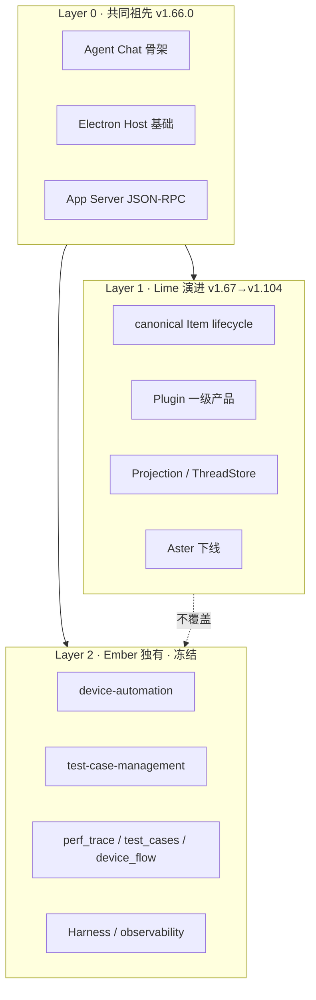

# Ember PC ← Lime 框架升级技术方案

> 状态：M0.5 已完成；工作区已含 Lime Batch A–D 约 63–79% 增量（待收口验证）  
> 更新时间：2026-07-16  
> 分支：`feature/lime-framework-upgrade`  
> 进度日志：[`lime-framework-upgrade-progress.md`](./lime-framework-upgrade-progress.md)  
> 冻结清单：[`lime-framework-upgrade-freeze-manifest.json`](./lime-framework-upgrade-freeze-manifest.json)（**Layer 2 事实源**）  
> 差异清单：[`lime-framework-upgrade-diff-inventory.md`](./lime-framework-upgrade-diff-inventory.md)  
> Host 接线审计：[`lime-framework-upgrade-host-wiring-audit.md`](./lime-framework-upgrade-host-wiring-audit.md)  
> 上游仓库：`/Users/lisq/project/agent/lime`  
> Fork 基点：`2cf98aa9034e64142e2387b6ce05495277b49919`（Lime v1.66.0，2026-06-12）  
> 目标基线：Lime `main` @ v1.104.0（`d1ddadf5f`）

## 1. 背景与目标

### 1.1 背景

Ember PC（`ember_pc`）从 Lime v1.66.0 分叉（2026-06-12），在共同祖先之上叠加了设备自动化测试平台能力。Lime 主链已演进到 v1.104.0（74 个提交、38 个 Release），完成了 Agent Runtime canonical Item lifecycle、Plugin 一级产品化、Aster 下线等重大架构重构。

Ember 当前仍停留在 v1.66.0 时代的框架骨架，并保留了 Lime 已在 v1.90+ 删除的遗留路径（`aster_backend`、`session_store`、`team_runtime_governor` 等）。

### 1.2 目标

| 目标 | 说明 |
| --- | --- |
| **G1** | 将 Lime `2cf98aa..HEAD` 的框架与基础能力合入 Ember |
| **G2** | 保留 Ember 测试平台**用户可见行为与数据模型**；允许 1 条强制 Host/API 迁移（`aiGeneration.ts`，ADR-06） |
| **G3** | 保持 Ember 品牌与包命名（`@embercloud/*`、`熠测`），不引入 `@embercloud/*` |
| **G4** | 每批次可编译、可验证、可回滚 |

### 1.3 非目标

- 不重命名 Ember 测试平台 UI 或业务流程
- 不将 Ember 回退为 Lime 品牌产品
- 不在本轮同步 Lime 五语言 i18n（框架文案只改 `zh-CN` + `en-US`；本轮以 `.cursor/rules/05-i18n-bilingual-only.mdc` 为准，覆盖 `AGENTS.md` 五语言默认）
- 不重构测试平台架构（除非框架升级强制迁移消费面）

---

## 2. 现状分析

### 2.1 版本与分叉关系

```text
Lime v1.66.0 (2cf98aa, 2026-06-12)
    ├── Lime main → v1.104.0 (74 commits, 38 releases)
    └── Ember PC (2483699, 2026-06-20) → main @ 2665fa7
            └── feature/lime-framework-upgrade（本计划执行分支）
```

### 2.2 Lime fork 后变更规模（`2cf98aa..HEAD`）

| 目录 | 变更文件数 | 增/删行（约） | 性质 |
| --- | --- | --- | --- |
| `ember-rs/` | 2032 | +355k / -414k | 净删，架构重构 |
| `src/components/agent/` | 1572 | +289k / -97k | Agent Chat 大改 |
| `src/lib/` | 441 | +75k / -28k | Runtime / API / DevBridge |
| `packages/` | 173 | +57k / -9k | 协议 client / projection |
| `scripts/` | 375 | +114k / -17k | 治理 / smoke / 构建 |
| `electron/`（不含 deviceAutomation） | 42 | +13k / -5k | Host 层 |

**关键事实**：`2cf98aa..HEAD` 在 `ember-rs` 中**零变更**涉及 `perf_trace` / `test_case` / `device_flow` — 证明测试后端为 Ember 100% 独有增量。

### 2.3 Ember 独有模块（冻结区 Layer 2）

#### 前端

| 模块 | 路径 | 规模 |
| --- | --- | --- |
| 设备自动化 | `src/features/device-automation/**` | ~153 文件 |
| 用例管理 | `src/features/test-case-management/**` | ~25 文件 |
| Agent 可观测 | `src/features/agent-observability/**` | ~9 文件 |
| Harness 卡片 | `src/components/agent/chat/components/Harness*.tsx` 等 | Ember 独有 |
| 测试 API 网关 | `src/lib/api/device*.ts`、`deviceStabilityAnalysis.ts` 等 | — |

设备自动化子域：

```text
device-automation/
├── explore/          # UI 探索 / dump 启发式
├── monkey/           # Monkey / Fastbot / Kea2
├── stability/        # 稳定性崩溃分析
├── performance/      # APM / Perfetto Trace
├── flow/             # 确定性测试流
├── scrcpy/           # 投屏
└── constants/        # Tab 路由
```

#### Electron Host

| 模块 | 路径 |
| --- | --- |
| 设备自动化运行时 | `electron/deviceAutomation/**` |
| Sidecar 入口 | `electron/deviceAutomationSidecar.ts` |
| Ember 品牌 | `electron/productIdentity.ts` |
| Preload 扩展 | `electron/preload/**`（含测试命令白名单时保留） |

#### 构建脚本

```text
scripts/device-automation/
├── ensure-scrcpy-server.mjs
├── ensure-fastbot-python.mjs
├── stage-device-automation-resources.mjs
├── download-adb-platform-tools.mjs
└── perf-monitor-adb-smoke.mjs
```

`package.json` 中对应脚本：

- `electron:build:host:dev` — 含 scrcpy / fastbot 预检
- `electron:build:device-automation-assets`
- `smoke:perf-monitor-adb`

#### Rust 后端（`ember-rs`，`ember-rs` 不存在）

```text
ember-rs/crates/
├── app-server-protocol/src/protocol/v0/
│   ├── perf_trace.rs
│   ├── test_cases.rs
│   └── device_flow.rs
├── app-server/src/
│   ├── local_data_source/{perf_trace,test_cases,device_flow}.rs
│   └── processor/{perf_trace,test_cases,device_flow}.rs
└── core/src/database/dao/
    ├── perf_trace_dao.rs
    ├── test_case_dao.rs
    └── device_flow_dao.rs
```

#### 规格与契约

- `specs/001-test-case-management/`
- `specs/002-device-performance-monitor/`
- `specs/003-deterministic-flow-self-healing/`
- `specs/004-stability-assurance/`

### 2.4 命名分叉（需策略处理）

| 维度 | Lime v1.104 | Ember 当前 |
| --- | --- | --- |
| 产品名 | Lime | 熠测 / Ember |
| npm scope | `@embercloud/*` | `@embercloud/*` |
| Rust 目录 | `ember-rs/` | `ember-rs/` |
| Plugin 页面 | `plugin` / `plugins` / `plugin-lab` | 同时存在 `plugin` + `agent-app`（~199 文件） |
| Memory 页面 | 无（`page.ts` 未列出） | 有 `"memory"` 路由 |
| CLI 包 | `ember-cli-npm` | `ember-cli-npm` |

### 2.5 高冲突遗留（Ember 有、Lime 已删）

| Ember 文件 | Lime 处置版本 | 风险 |
| --- | --- | --- |
| `ember-rs/.../aster_backend.rs` | v1.90 下线 | 用例 AI 生成仍传 `asterChatRequest` |
| `ember-rs/crates/agent/src/session_store*.rs` | v1.104 删除 | Agent Chat 历史加载路径变更 |
| `ember-rs/crates/agent/src/team_runtime_governor.rs` | v1.104 删除 | Team 子代理编排 |
| `ember-rs/crates/agent/src/subagent_*.rs` | v1.90+ 收口 | 子代理控制 |

---

## 3. 架构原则

### 3.1 三层边界模型



### 3.2 合并纪律

1. **先 Lime diff，后 Ember overlay**：以 `git diff 2cf98aa..HEAD -- <dir>` 为合入源，合入后再恢复 Layer 2 文件。
2. **协议四侧同步**：Electron preload 白名单、Host 命令、`safeInvoke` / `commandPolicy`、`app-server-client` schema 必须一致（见 `AGENTS.md` 工程硬规则 #3）。
3. **禁止双轨**：不保留 Lime 已标记 `dead` 的路径作为并行 fallback。
4. **品牌隔离**：合入 lime 源码后批量替换产品字符串，但**不**改 `@embercloud` scope 和 `ember-rs` 路径。
5. **测试平台零语义变更**：Layer 2 的 Host 命令名、JSON-RPC method、DB schema 不得破坏性修改。

### 3.3 合入工具链

```bash
# Lime 侧：按批次导出 patch + 冻结边界预检
LIME=/Users/lisq/project/agent/lime
npm run lime-framework:export-patch -- --batch A --check

# Ember 侧：试应用（不提交）
git apply --check /tmp/lime-batch-a.patch

# 合入后：工作区冻结边界检查
npm run lime-framework:check-freeze
npm run lime-framework:check-freeze:staged   # 提交前

# 验证
npm run verify:local
npm run test:contracts
cargo test --manifest-path ember-rs/Cargo.toml
```

**对齐脚本**（`scripts/lime-framework-upgrade/`）：

| 脚本 | 作用 |
| --- | --- |
| `check-freeze-boundary.mjs` | 断言变更未触碰 Layer 2（读 freeze-manifest） |
| `export-lime-batch-patch.mjs` | 从 Lime 按批次导出 diff，可选 `--check` |
| `README.md` | 合入 SOP 与 npm 快捷命令 |

合入纪律补充：**每批合入前** `export-patch --check`，**每批合入后** `check-freeze` + L1–L2 门禁。

---

## 4. 分批升级计划

按 Lime Release 里程碑分 4 批，每批可独立 PR、独立验证。批次边界 SHA 见 [`lime-framework-upgrade-diff-inventory.md`](./lime-framework-upgrade-diff-inventory.md)。

### M0.5：Host 接线补齐（Batch A 前置阻塞）⚠️

**背景**：审计发现 `device_automation_*` 未注册到 `ipcChannels.ts` / `hostCommands.ts`，测试平台在 Electron 生产路径不可达。详见 [`lime-framework-upgrade-host-wiring-audit.md`](./lime-framework-upgrade-host-wiring-audit.md)。

| 步骤 | 动作 |
| --- | --- |
| 1 | 从 `src/lib/api/device*.ts` 导出完整命令清单 |
| 2 | 四侧接线：`ipcChannels` + `hostCommands` + `main.ts` 事件 + `commandPolicy` |
| 3 | 契约守卫 + `typecheck:electron` + `test:contracts` |
| 4 | T1/T2/T5 最小冒烟 |

**验收**：任意 `device_automation_*` invoke 不再返回 `not supported`；独立 commit `framework-upgrade/m0.5-host-wiring`。

### Batch A：v1.67 → v1.80（构建基线 + Plugin 骨架）

**Lime diff**：`2cf98aa..b95403785`

**主题**：发布管线修复、Projection Store 初版、Plugin 一级产品概念、内容工厂 dogfood

| 合入域 | 关键路径 | 排除 |
| --- | --- | --- |
| 构建 / Forge | `forge.config.mjs`、`scripts/electron/*` | `scripts/device-automation/` |
| packages 初版 | `packages/app-server-client`、`agent-runtime-client` | — |
| Plugin 骨架 | `src/features/plugin/**`（v1.80 前段） | `src/features/agent-app/**`（保留） |
| Electron Host | `electron/appServerHost.ts`、`pluginShellHost.ts` | `electron/deviceAutomation/**` |
| 治理脚本 | `scripts/check-*.mjs`、`scripts/governance/**` | — |

**Ember 特有处理**：

- 保留 `electron/productIdentity.ts`
- `package.json` 中 device-automation build 步骤不删
- Plugin 与 agent-app 并存：以 lime `plugin` 框架为准升级，agent-app 作为 Ember 品牌适配层后续对齐

**验收**（前提：M0.5 已完成）：

```bash
npm run verify:app-version
npm run electron:build:smoke
npm run test:contracts
# 测试平台不退化（Batch A 即跑）
# T1 设备列表 · T2 monkey status · T6 用例 CRUD 列表
```

---

### Batch B：v1.80 → v1.90（Plugin UI + Runtime 迁移前奏）

**Lime diff**：`b95403785..10d9a2e0d`

**主题**：Plugin 中心 / Marketplace、Claw composer 插件激活、Soul/风格、Workspace 模块化起步

| 合入域 | 关键路径 |
| --- | --- |
| Plugin UI | `src/features/plugin/ui/**`、`src/features/plugin-content-factory/**` |
| Agent Chat（局部） | `src/components/agent/chat/` 中 plugin chip、right surface |
| src/lib | `src/lib/api/` 非 test 部分、`src/lib/agent/**` |
| i18n（框架） | `zh-CN` + `en-US` 的 `agent.json`、`navigation.json`、`plugin.json` |
| ember-rs（局部） | `app-server/local_data_source/plugins.rs`、`agent_apps.rs` |

**Ember 特有处理**：

- **不**删除 `src/features/agent-app/**`，建立映射：`agent-app` 路由 → lime `plugin` runtime（交付 [`lime-framework-upgrade-plugin-mapping.md`](./lime-framework-upgrade-plugin-mapping.md)）
- Memory 页面（Ember 独有）保留
- `ember-rs/...` 合入时按 **ADR-08** 映射到 `ember-rs/`（见 §9）

**验收**：

```bash
npm run verify:local
npm run verify:gui-smoke
```

---

### Batch C：v1.90 → v1.100（Aster 下线 + Runtime 收口）⚠️ 最高风险

**Lime diff**：`10d9a2e0d..56e4e7d9a`

**主题**：Aster backend 物理删除、Agent Runtime current 接管、Codex Thread/Turn/Item 主链、MCP elicitation

| 合入域 | 关键路径 |
| --- | --- |
| ember-rs 主体 | `crates/agent/**`、`crates/app-server/**`、`crates/runtime-core/**` |
| packages 全量 | `agent-runtime-projection`、`agent-runtime-client`、`agent-ui-contracts` |
| Agent Chat 主体 | `src/components/agent/**` |
| DevBridge | `src/lib/dev-bridge/**`、`src/lib/api/agentRuntime/**` |

**Ember 特有处理（关键）**：

1. **保留测试 Rust 模块**（合入后重新挂载）：`processor/`、`local_data_source/`、`dao/`、`protocol/v0/` 下 perf_trace / test_cases / device_flow 全套
2. **迁移 `test-case-management/aiGeneration.ts`**：`hostOptions.asterChatRequest` → lime canonical `startTurn`（**唯一强制迁移的测试链路**；交付 [`lime-framework-upgrade-aster-migration.md`](./lime-framework-upgrade-aster-migration.md)）
3. **删除 Ember 遗留**（lime 已删）：见 freeze-manifest `highConflictLegacyToRemove` + `session_store*.rs` 整组
4. **保护 Ember 独有 API**：`src/lib/api/agentRuntime/` 中 `mediaClient`、`subagentClient` 等（见 freeze-manifest `emberOnlyAgentRuntimeApi`）

**验收**：

```bash
npm run test:rust:unit
npm run test:contracts
npm run verify:local:full
npm run smoke:perf-monitor-adb
```

---

### Batch D：v1.100 → v1.104（canonical Item lifecycle）⚠️ 最大破坏性

**Lime diff**：`56e4e7d9a..d1ddadf5f`

**主题**：Message/Reasoning/Plan canonical lifecycle、删 session_hydration、删旧 provider lowering、ThreadStore 唯一事实源

| 合入域 | 关键路径 |
| --- | --- |
| ember-rs 收尾 | `crates/agent/` lifecycle 模块、`app-server` read model |
| Agent Chat UI | timeline、approval、media workbench、task index |
| 协议 | `app-server-protocol/schema/**`、generated types |
| Electron | `hostCommands.ts`（非 device 段）、`ipcChannels.ts` |

**Ember 特有处理**：

- 保留 Harness 模块（`src/components/agent/chat/components/Harness*`、`useHarness*`），适配新 projection event 类型
- `device_automation_*` Host 命令段从 M0.5 接线产物 **append** 到合入后的 `hostCommands.ts`，禁止被 lime diff 覆盖
- `commandPolicy.ts` 中测试命令保持 `current`

**验收**：

```bash
npm run verify:local:full
npm run verify:gui-smoke
npm run bridge:health -- --timeout-ms 120000
```

---

## 5. Layer 2 冻结清单

完整机器可读清单见 [`lime-framework-upgrade-freeze-manifest.json`](./lime-framework-upgrade-freeze-manifest.json)。**冲突时以 manifest 为准**，本节仅摘要。

### 5.1 目录级冻结

```text
src/features/device-automation/
src/features/test-case-management/
src/features/agent-observability/
electron/deviceAutomation/
electron/deviceAutomationSidecar.ts
scripts/device-automation/
specs/001-test-case-management/
specs/002-device-performance-monitor/
specs/003-deterministic-flow-self-healing/
specs/004-stability-assurance/
electron/productIdentity.ts
scripts/branding/
packages/ember-cli-npm/
```

### 5.2 Host 命令冻结（Electron）

| 命令前缀 | 功能域 |
| --- | --- |
| `device_automation_monkey_*` | Monkey / Fastbot |
| `device_automation_kea2_*` | Kea2 侧车 |
| `device_automation_stability_*` | 稳定性分析 |
| `device_automation_stability_llm_config_*` | 稳定性 LLM 配置 |
| `device_automation_perf_*` | 性能采集 |
| `device_automation_perf_trace_*` | Perfetto Trace |
| `device_automation_stability_analysis_event` | 稳定性事件推送 |

### 5.3 页面路由冻结

`src/types/page.ts` 中 Ember 独有 Page：

```typescript
| "device-automation"
| "agent-observability"
| "test-case-management"
| "agent-app" | "agent-apps" | "agent-app-lab"
| "memory"
```

`DeviceAutomationWorkspaceTab` 全部 Tab 保持：

```text
ai-case-generation | ui-auto-test | stability-assurance |
performance | startup-time | packet-capture | devices
```

---

## 6. 验证矩阵

### 6.1 每批次门禁

| 级别 | 命令 | 适用批次 |
| --- | --- | --- |
| L1 编译 | `npm run typecheck` + `npm run typecheck:electron` | A–D |
| L2 契约 | `npm run test:contracts` | A–D |
| L3 Rust | `cargo test --manifest-path ember-rs/Cargo.toml` | C–D |
| L4 本地全量 | `npm run verify:local` | B–D |
| L5 GUI | `npm run verify:gui-smoke` | B–D |

### 6.2 测试平台专项回归（每批次必跑）

| # | 场景 | 验证点 |
| --- | --- | --- |
| T1 | 设备列表 / scrcpy 投屏 | `device-automation` → devices Tab |
| T2 | Monkey 测试启动/停止 | `device_automation_monkey_*` |
| T3 | Kea2 工具状态 | `device_automation_kea2_get_tool_status` |
| T4 | 稳定性崩溃分析 | stability-assurance Tab，sa-agent spawn |
| T5 | 性能采集 + Trace 分析 | performance Tab，`smoke:perf-monitor-adb` |
| T6 | 用例管理 CRUD | test-case-management 列表/编辑/运行 |
| T7 | AI 用例生成 | Batch C 后重点回归；验收：给定 prompt 仍能生成合法用例 JSON，无 `asterChatRequest` |
| T8 | 确定性测试流 | flow 库列举/保存/回放 |
| T9 | Agent 可观测 | agent-observability tracing Tab |

### 6.3 完成判定

- **框架升级完成**：Batch A–D 全部合入，L1–L5 通过
- **测试平台不退化**：T1–T9 全部通过
- **整体目标完成度口径**：框架 v1.104 对齐 100%；测试功能保持 100%

---

## 7. 风险与缓解

| 风险 | 概率 | 影响 | 缓解 |
| --- | --- | --- | --- |
| Batch C aster 迁移失败 | 高 | 用例 AI 生成不可用 | 单独立项改造 `aiGeneration.ts` |
| hostCommands 合并冲突 | 高 | 测试命令丢失 | 段式合并：先 lime 非 device 段，再 append ember device 段 |
| ember-rs 合入后测试 processor 未注册 | 中 | 数据无法持久化 | checklist 强制检查 `mod.rs` 注册项 |
| Harness 卡片与新版 projection 不兼容 | 中 | 测试 handoff 断裂 | Batch D 单独适配 |
| Plugin vs agent-app 双轨 | 中 | 导航混乱 | Batch B 产出映射文档 |
| 构建脚本覆盖 device-automation 步骤 | 中 | 打包缺 adb/scrcpy | merge `package.json` 时保护 device 脚本 |

### 回滚策略

- 每批次独立 commit / PR，tag 建议 `framework-upgrade/batch-{A|B|C|D}`
- Batch C/D 失败可回滚到 Batch B 稳定点
- Layer 2 合入前备份：`tar czf layer2-freeze.tar.gz`（路径见 freeze manifest）

---

## 8. 里程碑与工期估算

| 里程碑 | 内容 | 预估 |
| --- | --- | --- |
| M0 | 差异清单 + Layer 2 备份 + 合入工具脚本 | 1–2 天 |
| M0.5 | Host 接线补齐（C1 修复） | 1–2 天 |
| M1 | Batch A 合入 + 验证 | 2–3 天 |
| M2 | Batch B 合入 + Plugin/agent-app 映射 | 3–5 天 |
| M3 | Batch C 合入 + aster 迁移 + 测试 Rust 重挂载 | 5–8 天 |
| M4 | Batch D 合入 + Harness 适配 + 全量回归 | 5–8 天 |
| M5 | 文档收口 + merge main | 1 天 |

**总计**：约 17–27 个工作日（视冲突量浮动）

---

## 9. 决策记录（ADR）

| ID | 决策 | 理由 |
| --- | --- | --- |
| ADR-01 | Fork 基点固定为 `2cf98aa` | 用户确认，对应 v1.66.0 |
| ADR-02 | 分 4 批按 Release 合入 | 降低冲突风险，每批可验证 |
| ADR-03 | Layer 2 skip + restore，不做三方 merge | lime 无这些文件 |
| ADR-04 | `ember-rs` 目录名不改，内容对齐 `ember-rs` | 避免全仓库路径替换 |
| ADR-05 | `agent-app` 品牌层保留，框架以 lime `plugin` 为准 | 不影响 Ember 产品定位 |
| ADR-06 | `aiGeneration.ts` 允许唯一测试链路 API 迁移 | aster 已被 lime 删除 |
| ADR-07 | 框架 i18n 只同步 zh-CN + en-US | 遵守仓库 i18n 规则 05 |
| ADR-08 | `ember-rs` 内容合入 `ember-rs` 路径，不改目录名 | 避免全仓库路径替换；合入 SOP 见 diff-inventory |
| ADR-09 | M0.5 Host 接线为 Batch A 硬前置 | 审计证实 device 命令未注册 IPC；见 host-wiring-audit |
| ADR-10 | 合入前/后跑 `lime-framework:check-freeze` | 机械守卫 Layer 2，读 freeze-manifest |

---

## 10. 附录

### A. Lime Release 时间线（fork 后）

```text
v1.67–v1.69  发布管线修复
v1.70–v1.75  Projection Store、会话过滤
v1.80–v1.85  Plugin 一级产品、内容工厂
v1.90–v1.95  Aster 下线、Soul/风格
v1.96–v1.99  MCP elicitation、media reference
v1.100–v1.103 Codex Thread/Turn/Item、Workspace 拆分
v1.104       canonical Item lifecycle（目标基线）
```

### B. 合入后目录结构目标

```text
ember_pc/
├── ember-rs/              # 内容 = ember-rs@v1.104 + Layer 2 Rust 模块
├── electron/
│   ├── deviceAutomation/  # [冻结] Ember 独有
│   └── ...                # = lime electron@v1.104 + productIdentity
├── src/features/
│   ├── device-automation/ # [冻结]
│   ├── test-case-management/ # [冻结]
│   ├── agent-observability/  # [冻结]
│   ├── agent-app/         # [保留] Ember 品牌
│   └── plugin/            # = lime plugin@v1.104
├── packages/              # = lime packages@v1.104（scope 保持 @embercloud）
└── scripts/
    ├── device-automation/ # [冻结]
    └── ...                # = lime scripts@v1.104
```

### C. 批次 tag 对照（快捷）

| 批次 | `git diff` 范围 |
| --- | --- |
| A | `2cf98aa..b95403785`（→ v1.80.0） |
| B | `b95403785..10d9a2e0d`（→ v1.90.0） |
| C | `10d9a2e0d..56e4e7d9a`（→ v1.100.0） |
| D | `56e4e7d9a..d1ddadf5f`（→ v1.104.0） |

### D. 关联文档

- Host 接线审计：[`lime-framework-upgrade-host-wiring-audit.md`](./lime-framework-upgrade-host-wiring-audit.md)
- 差异清单：[`lime-framework-upgrade-diff-inventory.md`](./lime-framework-upgrade-diff-inventory.md)
- 端自动化统一计划：[`device-automation-unify-agent-device-scrcpy-plan.md`](./device-automation-unify-agent-device-scrcpy-plan.md)
- 性能监控计划：[`device-performance-monitor-plan.md`](./device-performance-monitor-plan.md)
- 用例管理：[`test-case-management.md`](./test-case-management.md)
- 品牌重命名记录：[`brand-rename-lime-to-ember-progress.md`](./brand-rename-lime-to-ember-progress.md)
