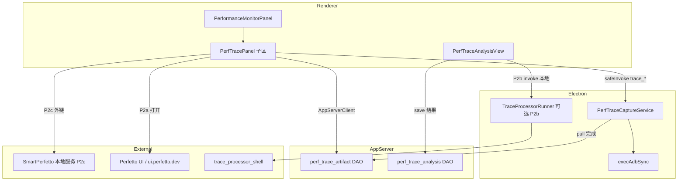

# P2 · Perfetto Trace 录制与性能数据分析设计

**Feature**: `002-device-performance-monitor`  
**日期**: 2026-06-17  
**状态**: 设计稿（待评审）  
**前置**: P1 已交付（ADB 标量 APM + 会话摘要 SQLite）  
**关联**: [collection-architecture.md](./collection-architecture.md) §5 · [data-model.md](./data-model.md) · 参考工程 `perf/SmartPerfetto`

---

## 1. 背景与目标

### 1.1 P1 已解决什么

P1 提供 **1Hz 标量 APM**：CPU%、PSS、FPS 曲线 + 停止时会话 AVG/MAX/MIN。适合开发/回归时「看着跑」、快速对比两次测试的摘要。

### 1.2 P1 解决不了什么

标量曲线 **无法回答**：

- 某一帧为什么掉帧（主线程阻塞在哪、RenderThread 是否饿死）
- 冷启动慢在哪个阶段（Zygote、bindApplication、首帧）
- Binder 风暴、GC 停顿、锁竞争、GPU 频率是否与卡顿对齐

这些问题需要 **Perfetto trace**（纳秒级事件）+ **SQL 分析**（或 SmartPerfetto Skill/Agent）。

### 1.3 P2 目标（一句话）

在性能监控 Tab 内增加 **「深度 Trace」产品线**：Android 上录制 → pull → 工作区 artifact 管理 → **分层性能数据分析**（模板 SQL → 可选 SmartPerfetto 深度分析），与 P1 实时曲线 **并行、不混通道、不混表**。

### 1.4 非目标（P2 不做）

| 项 | 说明 |
| --- | --- |
| 用 Perfetto 替代 P1 曲线 | trace 文件不适合 1Hz 实时推帧 |
| 内嵌完整 SmartPerfetto Node Agent 后端 | 违背 Ember「App Server 单一后端」；LLM 栈独立运维 |
| iOS Instruments → Perfetto（btrace） | 归 **P3** |
| 历史 trace 逐帧回放进 Ember SVG 图表 | 用 Perfetto UI / 分析报告呈现 |
| 替换 ui.perfetto.dev | 可作为「系统浏览器打开」降级 |

---

## 2. 双产品线关系

```text
┌─────────────────────────────────────────────────────────────────┐
│ 性能监控 Tab                                                     │
├────────────────────────────┬────────────────────────────────────┤
│  P1 · 实时 APM（已有）      │  P2 · 深度 Trace（新增）            │
│  开始/停止 · 1Hz 曲线       │  录制/停止 · artifact 列表          │
│  device_automation_perf_*  │  device_automation_perf_trace_*    │
│  perf_frame 事件           │  （无实时推帧；进度用 IPC 事件）       │
│  performance_sessions      │  performance_trace_artifacts       │
│  summary AVG/MAX/MIN       │  analysis_json / 外链 SmartPerfetto │
└────────────────────────────┴────────────────────────────────────┘
         共享：设备选择、应用包名、工作区隔离、同设备互斥策略
```

**关联策略（可选）**：P2 trace 录制可 **绑定** 当前 P1 `sessionId`（同一轮测试先开曲线再录 trace），但 **不强制**；artifact 表 `linked_session_id` 可空。

---

## 3. 用户场景

### US-P2-1 · 录制 Perfetto Trace（Priority: P2a）

测试人员在 Android 设备上点击「录制 Trace」，选择预设（滑动卡顿 / 冷启动 / 自定义），系统通过 adb 启动 `perfetto` 采集，停止后 pull 到工作区并出现在 Trace 列表。

**验收**：3 分钟内完成 录制 → 停止 → 列表可见 → 文件大小 > 0。

### US-P2-2 · 打开 Trace 可视化（Priority: P2a）

用户点击 artifact 的「在 Perfetto UI 打开」：优先本地 bundled Perfetto UI（若已配置），否则 `https://ui.perfetto.dev` 上传，或 **外链本地 SmartPerfetto** 工作区。

**验收**：trace 可在时间轴上浏览 slice/track。

### US-P2-3 · 模板化性能分析（Priority: P2b）

用户对某条 trace 点击「快速分析」，选择 **卡顿 / 启动 / CPU 概览** 之一，Ember 在本地 spawn `trace_processor_shell`，跑固定 SQL 模板，在 Tab 内展示结构化结果（无需 LLM）。

**验收**：对 SmartPerfetto 测试 trace 之一，30 秒内返回 jank 帧数 + P99 帧耗时等字段。

### US-P2-4 · 深度分析（Priority: P2c，可选）

用户点击「在 SmartPerfetto 中深度分析」，Ember 将 artifact 路径 + `packageName` 传给 SmartPerfetto（HTTP upload 或 deep link），复用其 YAML Skill / Agent 编排。

**验收**：SmartPerfetto 侧能加载同一条 trace 并跑 `scrolling_analysis` 或 `startup_analysis`。

---

## 4. 总体架构



**分层原则**（对齐 Ember 约束）：

| 层 | 职责 | 禁止 |
| --- | --- | --- |
| Electron | adb 录制、stop、pull、文件落盘、可选 spawn `trace_processor_shell` | 业务 SQL 持久化、LLM |
| App Server | artifact / analysis 元数据 CRUD、工作区路径解析 | adb、spawn trace |
| Renderer | 列表、进度、报告展示、外链 | 直接 adb |
| SmartPerfetto | 深度 Skill + Agent + 完整 UI | 写入 Ember SQLite |

---

## 5. 采集层 · PerfTraceCaptureService

实现位置（规划）：`electron/deviceAutomation/perfTraceCapture.ts`

### 5.1 录制预设

| presetId | 用途 | config 要点 |
| --- | --- | --- |
| `scroll_jank` | 滑动卡顿 | `android.surfaceflinger.frametimeline`, `android.frames.timeline`, `sched`, `gfx` |
| `cold_start` | 冷启动 | `android.startup.startups`, `am`, `binder`, `sched` |
| `cpu_sched` | CPU/调度概览 | `sched`, `linux.cpu`, `power` |
| `custom` | 高级用户 | UI 勾选 category（P2b+） |

config 以 **文本 proto** 写入设备 `/data/local/tmp/ember_perf_<captureId>.cfg`，不打包 perfetto CLI 到 APK。

### 5.2 命令序列（Android）

```text
1. adb shell mkdir -p /data/local/tmp /data/misc/perfetto-traces
2. adb push ember_perf.cfg → /data/local/tmp/
3. adb shell perfetto --txt -c /data/local/tmp/ember_perf.cfg \
     -o /data/misc/perfetto-traces/ember_<captureId>.perfetto-trace
   （后台 & 或 perfetto --background-wait，按 API level 选型）
4. stop: adb shell pkill -INT perfetto 或 perfetto --stop
5. adb pull → {workspacePerfTracesDir}/{captureId}.perfetto-trace
6. adb shell rm 临时 cfg/trace（best-effort）
```

**设备要求**：Android 9+ 推荐；需 `perfetto` 在设备侧可用（AOSP/userdebug 或厂商开放 trace 权限）。录制失败时返回可读错误（权限 / 无 perfetto / 磁盘满）。

### 5.3 与 P1 互斥

| 规则 | 行为 |
| --- | --- |
| 同设备 P1 采集中 | 允许并行 trace 录制（不同数据源），但 UI 默认提示「可能影响性能」 |
| 同设备双 trace | **禁止**；新录制先 stop 旧 trace capture |
| pull 进行中 | 禁用删除 artifact |

### 5.4 进度事件

```typescript
export const DEVICE_AUTOMATION_PERF_TRACE_PROGRESS_EVENT =
  "device_automation_perf_trace_progress";

export type PerfTraceProgressPayload = {
  captureId: string;
  phase: "starting" | "recording" | "stopping" | "pulling" | "done" | "failed";
  bytesReceived?: number;
  bytesTotal?: number;
  error?: string;
};
```

---

## 6. 数据模型（P2 扩展）

详见 [p2-data-model.md](./p2-data-model.md)。摘要：

### 6.1 `performance_trace_artifacts`

| 字段 | 说明 |
| --- | --- |
| id | UUID |
| workspace_id | 工作区 |
| linked_session_id | 可选，关联 P1 `performance_sessions.id` |
| device_id / package_name | 设备与应用 |
| local_path | pull 后绝对路径（Ember 用户数据目录下） |
| remote_path | 设备侧路径 |
| size_bytes / duration_ms | 元数据 |
| preset_id / config_json | 录制预设 |
| status | `recording` \| `ready` \| `failed` |
| created_at | 时间戳 |

### 6.2 `performance_trace_analyses`（P2b）

| 字段 | 说明 |
| --- | --- |
| id | UUID |
| artifact_id | FK |
| analysis_type | `jank_summary` \| `startup_summary` \| `cpu_quadrant` \| `smartperfetto_export` |
| package_name | 分析目标包 |
| time_range_json | 可选 `{ startNs, endNs }` |
| result_json | 结构化结论（见 §7.2） |
| status | `pending` \| `done` \| `failed` |
| created_at | |

**不存** 原始 SQL 结果全表 dump；大结果写 `{artifactId}.analysis.{type}.json`  sidecar 文件可选。

---

## 7. 性能数据分析

### 7.1 三档分析能力

| 档位 | 名称 | 实现 | 用户感知 |
| --- | --- | --- | --- |
| **L0** | 可视化 | 打开 Perfetto UI | 自己看时间轴 |
| **L1** | 模板分析 | Ember 调 `trace_processor_shell --httpd` + 固定 SQL | Tab 内卡片：帧统计、启动耗时、线程状态占比 |
| **L2** | 深度分析 | 外链 SmartPerfetto Agent/Skill | 跳转或 iframe；HTML 报告链接回 Ember |

**P2 交付顺序**：L0 + artifact 管理（P2a）→ L1（P2b）→ L2（P2c）。

### 7.2 L1 模板分析 · 结果 schema（`result_json`）

#### `jank_summary`

```json
{
  "packageName": "com.example.app",
  "traceDurationMs": 12000,
  "totalFrames": 720,
  "jankFrames": 18,
  "severeJankFrames": 3,
  "p50FrameMs": 11.2,
  "p90FrameMs": 18.4,
  "p99FrameMs": 42.1,
  "missedVsyncCount": 12,
  "highlights": [
    { "tsNs": 1234567890, "frameMs": 48.2, "reason": "scheduling_delay" }
  ]
}
```

**SQL 来源**：Perfetto stdlib `android.frames.timeline` + SmartPerfetto `jank_frames` view（可 vendoring YAML/SQL 片段，不引入 Node 后端）。

#### `startup_summary`

```json
{
  "packageName": "com.example.app",
  "coldStartCount": 1,
  "timeToDisplayMs": 890,
  "breakdown": [
    { "phase": "bindApplication", "durMs": 120 },
    { "phase": "activityStart", "durMs": 340 }
  ]
}
```

**SQL 来源**：`android.startup.startups` / `android_startup_time_to_display`。

#### `cpu_quadrant`

```json
{
  "packageName": "com.example.app",
  "quadrants": {
    "running": 0.42,
    "runnable": 0.08,
    "sleeping": 0.45,
    "uninterruptible": 0.05
  },
  "topThreads": [
    { "name": "com.example.app", "cpuPercent": 28.5 }
  ]
}
```

**SQL 来源**：对齐 SmartPerfetto `four_quadrant` 模板（`sched` slice 聚合）。

### 7.3 L1 运行时 · TraceProcessorRunner（Electron）

```text
spawn trace_processor_shell --httpd --http-port <ephemeral> <localTracePath>
POST /query (protobuf) ← 复用 SmartPerfetto 客户端逻辑（可抽离为 npm workspace 包或 vendored TS）
kill on timeout / panel unmount
```

**二进制策略**：

| 方案 | 说明 | 决策 |
| --- | --- | --- |
| A. 不内置 | 仅 L0 + L2，L1 提示安装 SmartPerfetto | 否 |
| **B. 按需下载** | 首次 L1 分析触发；对齐 SmartPerfetto pin；支持 `PERFETTO_TRACE_PROCESSOR_PATH` 覆盖 | **✅ Clarify 2026-06-17 确认** |
| C. 随包内置 | 增大安装体积 ~50MB+ | 否 |

环境变量：`PERFETTO_TRACE_PROCESSOR_PATH`（与 SmartPerfetto 一致，便于共用）。

### 7.4 L2 · SmartPerfetto 集成

**推荐接口**（SmartPerfetto 已存在）：

```text
POST http://127.0.0.1:3000/api/traces/upload        ← multipart 文件
POST http://127.0.0.1:3000/api/skills/analyze      ← { traceId, skillId, packageName }
GET  http://127.0.0.1:3000/...                       ← 打开前端 trace 页
```

Ember 侧：

1. 检测 `GET http://127.0.0.1:3000/health`（可配置 `SMARTPERFETTO_BASE_URL`）
2. 可用 → 上传 artifact 或传 `file://` 路径（若同机且 SmartPerfetto 支持本地路径注册）
3. 不可用 → 仅 L0/L1 + 文档说明如何启动 SmartPerfetto

**不做的集成**：Ember 内嵌 SmartPerfetto Express、Claude Agent SDK、SSE 会话状态机。

### 7.5 与 P1 摘要的「联合解读」（UI 层）

同一条 `linked_session_id` 时，摘要 Modal 增加 Tab：

| Tab | 内容 |
| --- | --- |
| 实时摘要 | P1 AVG/MAX/MIN（已有） |
| Trace | 关联 artifact 列表 + L1 分析卡片 |
| 对比提示 | 例：「P1 FPS min=42 与 trace 中 3 次 severe jank 时间戳…」—— **规则模板文案**，非 LLM（P2b）；LLM 解读留 L2 |

---

## 8. 协议草案

完整契约见：

- [contracts/p2-electron-host-commands.md](./contracts/p2-electron-host-commands.md)
- [contracts/p2-json-rpc-methods.md](./contracts/p2-json-rpc-methods.md)

### 8.1 Electron Host（新增）

| 命令 | 说明 |
| --- | --- |
| `device_automation_perf_trace_start` | `{ deviceId, packageName, presetId, linkedSessionId? }` → `{ captureId }` |
| `device_automation_perf_trace_stop` | `{ captureId }` → `{ artifact: { localPath, sizeBytes, durationMs } }` |
| `device_automation_perf_trace_get_status` | 当前 recording capture |
| `device_automation_perf_trace_cancel` | 放弃录制，不 pull |
| `device_automation_perf_trace_analyze` | **P2b** `{ localPath, analysisType, packageName, timeRange? }` → `{ result }`（仅本地 TP，不写 DB） |
| `device_automation_perf_trace_open_external` | `{ localPath, target: 'perfetto_ui' \| 'smartperfetto' }` |

事件：`device_automation_perf_trace_progress`

### 8.2 App Server JSON-RPC（新增）

| 方法 | 说明 |
| --- | --- |
| `perfMonitor/trace/save` | upsert artifact 元数据（pull 完成后） |
| `perfMonitor/trace/list` | `{ workspaceId, limit?, offset? }` |
| `perfMonitor/trace/read` | `{ id }` |
| `perfMonitor/trace/delete` | **P2** 允许删除 trace（与 P1 会话删除策略分离） |
| `perfMonitor/traceAnalysis/save` | 保存 L1 结果 |
| `perfMonitor/traceAnalysis/list` | 按 artifact 查分析历史 |

---

## 9. UI 设计

### 9.1 Tab 布局演进（Clarify 2026-06-17：SegmentedControl 确认）

```text
┌─ Toolbar（P1 不变 + 模式切换）──────────────────────────────┐
│ [实时 APM] [深度 Trace]  ← SegmentedControl（共用设备/应用栏）  │
├─ 主区 ─────────────────────────────────────────────────────────┤
│ 实时模式：现有 Charts（P1）                                     │
│ Trace 模式：                                                   │
│   · 录制栏：预设下拉 | 开始录制 | 停止 | 进度条                  │
│   · Trace 列表：文件名 | 大小 | 时长 | 操作▼                    │
│       - 在 Perfetto UI 中打开 (L0)                             │
│       - 快速分析 → 子菜单：卡顿/启动/CPU (L1)                   │
│       - 在 SmartPerfetto 中分析 (L2)                           │
│   · 分析结果抽屉：PerfTraceAnalysisView（表格 + highlight 列表）│
├─ 底部历史（P1 会话，可折叠）────────────────────────────────────┤
└────────────────────────────────────────────────────────────────┘
```

**Tab 生命周期（Clarify 2026-06-17）：**

- **P1 实时 APM**：离开性能 Tab → 自动 stop（与 FR-011 一致）。
- **P2 Trace 录制**：离开性能 Tab 或 SegmentedControl 切至「实时 APM」→ **弹窗确认**（继续后台录制 / 停止并 pull），**默认继续**；回到 Tab 仍可见录制进度。

### 9.2 i18n

仅 **zh-CN / en-US**（规则 05）；键前缀 `deviceAutomation.performance.trace.*`

---

## 10. 分期交付

**P2 首版交付范围（Clarify 2026-06-17）**：**P2a + P2b**；P2c 延后。

| 阶段 | 范围 | 守门 |
| --- | --- | --- |
| **P2a** | Capture + pull + artifact 表 + L0 打开 UI + 进度事件 | 真机录制 smoke；契约四侧 |
| **P2b** | L1 三模板 + `trace_analyses` 表 + TraceProcessorRunner | SmartPerfetto test-traces 回归；单测 SQL 解析 |
| **P2c** | SmartPerfetto health + upload + deep link | **首版不做**（Clarify 2026-06-17：首版仅 P2a+P2b） |
| **P2+** | `performance_data` 窄表、CSV、P1 曲线与 trace 时间轴对齐 | 独立 spec 修订 |

---

## 11. 风险与决策

| ID | 决策 | 理由 |
| --- | --- | --- |
| D-P2-01 | trace 采集走 Electron，不走 App Server | adb 与 P1 一致 |
| D-P2-02 | L1 分析 spawn 在 Electron，结果持久化走 App Server | 二进制大、生命周期与桌面绑定 |
| D-P2-03 | 不内嵌 SmartPerfetto Agent | 避免第二后端与 LLM 配置分裂 |
| D-P2-04 | SQL 模板 vendoring 自 SmartPerfetto/skills，不运行时依赖其 Node 服务 | L1 可离线 |
| D-P2-05 | P2 允许删除 trace artifact；P1 会话仍不可删 | trace 体积大，需清理 |
| R-P2-01 | 厂商 ROM 禁用 perfetto | 文档 + 能力矩阵标注；降级仅 P1 |
| R-P2-02 | trace 文件 GB 级 | pull 进度事件；工作区配额提示（后续） |

---

## 12. 成功标准

| ID | 标准 |
| --- | --- |
| SC-P2-01 | 真机 5 分钟内完成 trace 录制并出现在工作区列表 |
| SC-P2-02 | L0：trace 可在 Perfetto UI 打开并看到 slice |
| SC-P2-03 | L1：对标准测试 trace，卡顿模板 30s 内返回 `jank_summary` |
| SC-P2-04 | L2：SmartPerfetto 运行时，一键跳转并完成至少一个 composite skill |
| SC-P2-05 | 与 P1 同时使用时无 crash；artifact 按 workspace 隔离 |

---

## 13. 参考映射

| Ember 规划 | SmartPerfetto 参考 |
| --- | --- |
| `PerfTraceCaptureService` | （无，需自建） |
| `TraceProcessorRunner` | `backend/src/services/workingTraceProcessor.ts` |
| L1 SQL 模板 | `backend/src/services/analysisTemplates/` + `backend/skills/composite/*.skill.yaml` |
| L2 Agent | `backend/src/routes/agentRoutes.ts` |
| test traces | `perf/SmartPerfetto/test-traces/*.pftrace` |

---

**下一步（实现前）**：评审本设计 → 更新 [spec.md](./spec.md) 增加 P2 User Stories → 编写 `p2-tasks.md` 与 exec-plan Phase P2 条目 → P2a 契约 PR。
